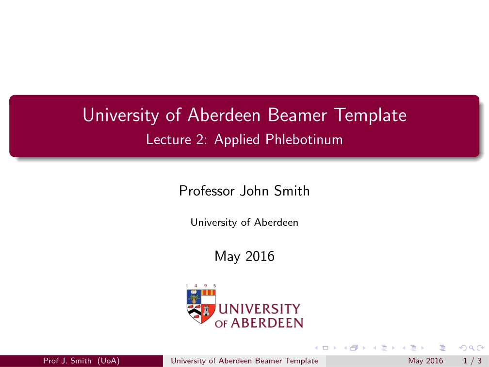

#University of Aberdeen Beamer Colour Theme

This colour theme uses UoA guidelines for branding to create a professional, stylish and readable [beamer](https://en.wikipedia.org/wiki/Beamer_%28LaTeX%29) theme for all your LaTeX presentation needs.

###Requirements

- LaTeX Installation  
- The beamer package (should come with LaTeX)  

Alternatively you could use a cloud based LaTeX editor like [ShareLaTeX](http://sharelatex.com/).

###Installation

1. Download the [latest release](https://github.com/kittsville/UoA-Beamer-Colour-Theme/releases)  
2. Unzip in your preferred location for LaTeX projects
3. Open `main.tex` and start making your presentation!

###Contributing

Feel free to make any fixes and improvements you fancy. If you need any help with beamer or LaTeX then check out the [LaTeX Stack Exchange](http://tex.stackexchange.com/) or [drop me an email](mailto:kittsville@gmail.com).

###License

The theme is licensed under the LaTeX Project Public License and/or the General Public License v2 or later license. The license included with the repository is the GPL v2 license.

### Disclaimer

This is **in no way** affiliated with or condoned by the University of Aberdeen. I just made this to help standardise the inconsistent uni branding in beamer slides.
